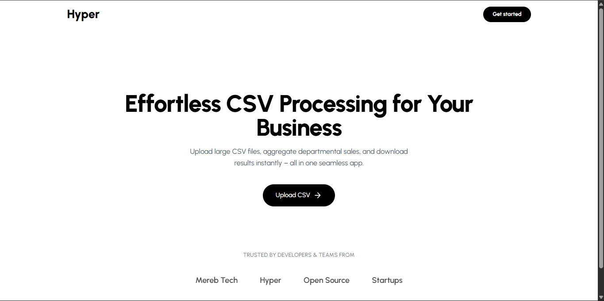

# Hyper-CSV (Node.js + React)

## Overview

Hyper-CSV is a fullstack application for processing large CSV files with departmental sales data. Users can upload a CSV, the backend aggregates total sales per department, and returns a downloadable CSV result. The frontend allows uploading, tracks progress, and enables file download.

---

## Features

### Backend

- Accepts CSV file uploads via HTTP POST (`/upload`)
- Aggregates total number of sales per department
- Returns a downloadable link to the processed CSV
- Handles large CSV files with streaming (`csv-parser`, `fs.createReadStream`)
- Written in TypeScript, modular, scalable, and testable
- Generates unique output filenames using UUIDs

### Frontend

- Upload CSV files
- Shows a progress indicator during processing
- Download the processed CSV
- Built with React or Next.js (App Router preferred)
- Uses Axios for backend communication

---

## Example

### Input CSV

| Department Name | Date       | Number of Sales |
| --------------- | ---------- | --------------- |
| Electronics     | 2023-08-01 | 100             |
| Clothing        | 2023-08-01 | 200             |
| Electronics     | 2023-08-02 | 150             |

### Output CSV

| Department Name | Total Number of Sales |
| --------------- | --------------------- |
| Electronics     | 250                   |
| Clothing        | 200                   |

---

## Live Preview

[Live Link](https://hyper-csv.vercel.app/)

[](https://hyper-csv.vercel.app/)

````

---

## Installation

### Backend

```bash
cd backend
npm install
npm run dev
````

### Frontend

```bash
cd cient
npm inst
```
